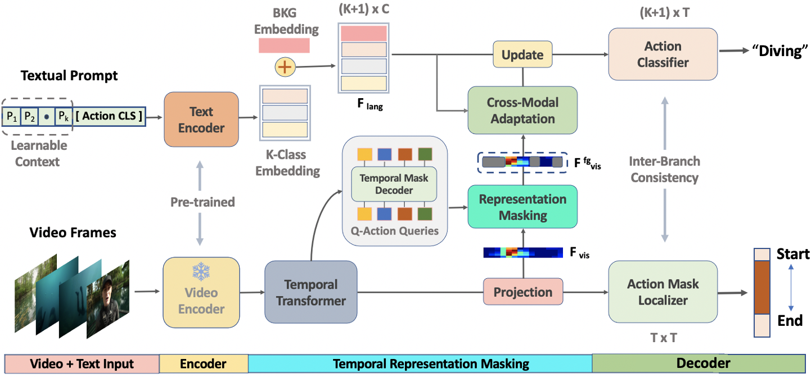

[](https://paperswithcode.com/sota/zero-shot-action-detection-on-activitynet-1-3?p=zero-shot-temporal-action-detection-via)
[](https://paperswithcode.com/sota/zero-shot-action-detection-on-thumos-14?p=zero-shot-temporal-action-detection-via)

<div align="center">

<h1>Zero-Shot Temporal Action Detection via Vision-Language Prompting</h1>

<div>
    <a href='https://sauradip.github.io/' target='_blank'>Sauradip Nag</a><sup>1,2,+</sup>&emsp;
    <a href='https://scholar.google.co.uk/citations?hl=en&user=ZbA-z1cAAAAJ&view_op=list_works&sortby=pubdate' target='_blank'>Xiatian Zhu</a><sup>1,3</sup>&emsp;
    <a href='https://scholar.google.co.uk/citations?user=irZFP_AAAAAJ&hl=en' target='_blank'>Yi-Zhe Song</a><sup>1,2</sup>&emsp;
    <a href='https://scholar.google.co.uk/citations?hl=en&user=MeS5d4gAAAAJ&view_op=list_works&sortby=pubdate' target='_blank'>Tao Xiang</a><sup>1,2</sup>&emsp;
</div>
<div>
    <sup>1</sup>CVSSP, University of Surrey, UK&emsp;
    <sup>2</sup>iFlyTek-Surrey Joint Research Center on Artificial Intelligence, UK&emsp; <br>
    <sup>3</sup>Surrey Institute for People-Centred Artificial Intelligence, UK
</div>
<div>
    <sup>+</sup>corresponding author
</div>

<h3><strong>Accepted to <a href='https://eccv2022.ecva.net/' target='_blank'>ECCV 2022</a></strong></h3>

<h4 align="center">
  <a href="" target='_blank'>[Project Page]</a> •
  <a href="https://arxiv.org/abs/2207.08184" target='_blank'>[arXiv]</a>
</h4>
<table>
<tr>
    <td></td>
</tr>
</table>
</div>

## Updates

- (July, 2022) We released STALE training and inference code for ActivityNetv1.3 dataset.
- (June, 2022) STALE is accepted by ECCV 2022.

## Summary
- First prompt-guided framework for Zero-Shot Temporal Action Detection (ZS-TAD) task.
- Adapted classification based CLIP to detection based TAD using Representation Masking.
- Transformer based Cross-Adaptation module to contextualize classifier using Vision-Language features.
- Inter-Branch consistency learning to make sure our model can find the accurate boundary.

## Abstract

Existing temporal action detection (TAD) methods rely on
large training data including segment-level annotations, limited to recognizing previously seen classes alone during inference. Collecting and annotating a large training set for each class of interest is costly and hence
unscalable. Zero-shot TAD (ZS-TAD) resolves this obstacle by enabling
a pre-trained model to recognize any unseen action classes. Meanwhile,
ZS-TAD is also much more challenging with significantly less investigation. Inspired by the success of zero-shot image classification aided by
vision-language (ViL) models such as CLIP, we aim to tackle the more
complex TAD task. An intuitive method is to integrate an off-the-shelf
proposal detector with CLIP style classification. However, due to the sequential localization (e.g., proposal generation) and classification design,
it is prone to localization error propagation. To overcome this problem, in
this paper we propose a novel zero-Shot Temporal Action detection model
via Vision-LanguagE prompting (STALE). Such a novel design effectively eliminates the dependence between localization and classification
by breaking the route for error propagation in-between. We further introduce an interaction mechanism between classification and localization
for improved optimization. Extensive experiments on standard ZS-TAD
video benchmarks show that our STALE significantly outperforms stateof-the-art alternatives. Besides, our model also yields superior results on
supervised TAD over recent strong competitors. 

## Architecture



## Getting Started

### Requirements
- Python 3.7
- PyTorch == 1.9.0  **(Please make sure your pytorch version is atleast 1.8)**
- NVIDIA GPU
- Hugging-Face Transformers
- Detectron

### Environment Setup
It is suggested to create a Conda environment and install the following requirements
```shell script
pip3 install -r requirements.txt
```

### Extra Dependencies
We have used the implementation of [Maskformer](https://github.com/facebookresearch/MaskFormer) for Representation Masking. 
```shell script
git clone https://github.com/sauradip/STALE.git
cd STALE
git clone https://github.com/facebookresearch/MaskFormer
```
Follow the [Installation](https://github.com/facebookresearch/MaskFormer/blob/main/INSTALL.md) instructions to install Detectron and other modules within this same environment if possible. After this step, place the files in ``` /STALE/extra_files ``` into ``` /STALE/MaskFormer/mask_former/modeling/transformer/ ```. 

### Download Features
Download the video features and update the Video paths/output paths in ``` config/anet.yaml ``` file. For now ActivityNetv1.3 dataset config is available. We are planning to release the code for THUMOS14 dataset soon. 

| Dataset | Feature | Pre-Training | Link | 
|:---:|:---:|:---:|:---:|
| ActivityNet | ViT-B/16-CLIP | CLIP | [Google Drive](https://drive.google.com/drive/folders/1OFyU7V-VPHYOkTfXTQR-XxLYO-rSgL_i?usp=sharing) |
| THUMOS | ViT-B/16-CLIP | CLIP | [Google Drive](https://drive.google.com/drive/folders/16eUrTrF8-S5ncb5psIN7ikP9GweAIP_t?usp=sharing) |
| ActivityNet | I3D | Kinetics-400 | [Google Drive](https://drive.google.com/drive/folders/1B1srfie2UWKwaC4-7bo6UItmJoESCUq3?usp=sharing) |
| THUMOS | I3D | Kinetics-400 | [Google Drive](https://drive.google.com/drive/folders/1C4YG01X9IIT1a568wMM8fgm4k4xTC2EQ?usp=sharing) |

### Training Splits
Currently we support the training-splits provided by [EfficientPrompt](https://github.com/ju-chen/Efficient-Prompt) paper. Both 50% and 75% labeled data split is available for training. This can be found in ``` STALE/splits ``` 

### Model Training 
To train STALE from scratch run the following command. The training configurations can be adjusted from  ``` config/anet.yaml ``` file.
```shell script
python stale_train.py
```
### Model Inference
We provide the pretrained models containing the checkpoints for both 50% and 75% labeled data split for zero-shot setting
| Dataset | Split (Seen-Unseen) | Feature | Link | 
|:---:|:---:|:---:|:---:|
| ActivityNet | 50%-50% | CLIP | [ckpt](https://drive.google.com/file/d/1DdJYl77YkRbU9DDczvX0ojCG_tqnBr6U/view?usp=sharing) |
| ActivityNet | 75%-25% | CLIP | [ckpt](https://drive.google.com/drive/folders/16eUrTrF8-S5ncb5psIN7ikP9GweAIP_t?usp=sharing) |

After downloading the checkpoints, the checkpoints path can be saved in ``` config/anet.yaml ``` file.
The model inference can be then performed using the following command 
```shell script
python stale_inference.py
```
### Model Evaluation
To evaluate our STALE model run the following command. 
```shell script
python eval.py
```
### TO-DO Checklist
- [ ] Fix the learnable-prompt issue in Huggig-Face Transformer
- [ ] Fix the NaN bug during Model-Training
- [ ] Support for THUMOS14 dataset
- [ ] Enable multi-gpu training

## Citation
If you find this project useful for your research, please use the following BibTeX entry.
```
@article{nag2022zero,
  title={Zero-shot temporal action detection via vision-language prompting},
  author={Nag, Sauradip and Zhu, Xiatian and Song, Yi-Zhe and Xiang, Tao},
  journal={arXiv e-prints},
  pages={arXiv--2207},
  year={2022}
}
```


