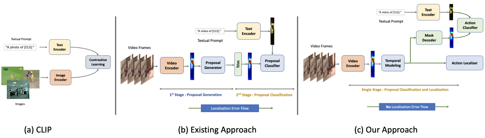

<h1>Zero-Shot Temporal Action Detection via Vision-Language Prompting</h1>

    <a href='https://sauradip.github.io/' target='_blank'>Sauradip Nag</a>1,2,+&emsp;
    <a href='https://scholar.google.co.uk/citations?hl=en&user=ZbA-z1cAAAAJ&view_op=list_works&sortby=pubdate' target='_blank'>Xiatian Zhu</a>1,3&emsp;
    <a href='https://scholar.google.co.uk/citations?user=irZFP_AAAAAJ&hl=en' target='_blank'>Yi-Zhe Song</a>1,2&emsp;
    <a href='https://scholar.google.co.uk/citations?hl=en&user=MeS5d4gAAAAJ&view_op=list_works&sortby=pubdate' target='_blank'>Tao Xiang</a>1,2&emsp;

    1CVSSP, University of Surrey, UK&emsp;
    2iFlyTek-Surrey Joint Research Center on Artificial Intelligence, UK&emsp;  
    3Surrey Institute for People-Centred Artificial Intelligence, UK

    +corresponding author

<h3><strong>Accepted to <a href='https://eccv2022.ecva.net/' target='_blank'>ECCV 2022</a></strong></h3>

<h4 align="center">
  <a href="" target='_blank'>[Project Page]</a> •
  <a href="https://arxiv.org/abs/2207.06580" target='_blank'>[arXiv]</a>
</h4>
<table>
<tr>
    <td></td>
</tr>
</table>

Stay Tuned ! Coming soon !

