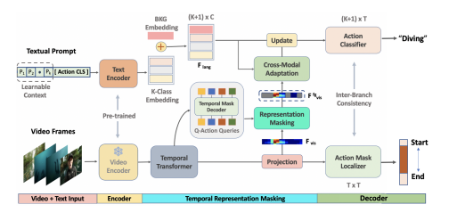

<h1>Zero-Shot Temporal Action Detection via Vision-Language Prompting</h1>

    <a href='https://sauradip.github.io/' target='_blank'>Sauradip Nag</a>1,2,+&emsp;
    <a href='https://scholar.google.co.uk/citations?hl=en&user=ZbA-z1cAAAAJ&view_op=list_works&sortby=pubdate' target='_blank'>Xiatian Zhu</a>1,3&emsp;
    <a href='https://scholar.google.co.uk/citations?user=irZFP_AAAAAJ&hl=en' target='_blank'>Yi-Zhe Song</a>1,2&emsp;
    <a href='https://scholar.google.co.uk/citations?hl=en&user=MeS5d4gAAAAJ&view_op=list_works&sortby=pubdate' target='_blank'>Tao Xiang</a>1,2&emsp;

    1CVSSP, University of Surrey, UK&emsp;
    2iFlyTek-Surrey Joint Research Center on Artificial Intelligence, UK&emsp;  
    3Surrey Institute for People-Centred Artificial Intelligence, UK

    +corresponding author

<h3><strong>Accepted to <a href='https://eccv2022.ecva.net/' target='_blank'>ECCV 2022</a></strong></h3>

<h4 align="center">
  <a href="" target='_blank'>[Project Page]</a> •
  <a href="https://arxiv.org/abs/2207.08184" target='_blank'>[arXiv]</a>
</h4>
<table>
<tr>
    <td></td>
</tr>
</table>

## Updates

- (July, 2022) We released STALE training and inference code for ActivityNetv1.3 dataset.
- (June, 2022) STALE is accepted by ECCV 2022.

## Summary
- First prompt-guided framework for Zero-Shot Temporal Action Detection (ZS-TAD) task.
- Adapted classification based CLIP to detection based TAD using Representation Masking.
- Transformer based Cross-Adaptation module to contextualize classifier using Vision-Language features.
- Inter-Branch consistency learning to make sure our model can find the accurate boundary.

## Abstract

Existing temporal action detection (TAD) methods rely on
large training data including segment-level annotations, limited to recognizing previously seen classes alone during inference. Collecting and annotating a large training set for each class of interest is costly and hence
unscalable. Zero-shot TAD (ZS-TAD) resolves this obstacle by enabling
a pre-trained model to recognize any unseen action classes. Meanwhile,
ZS-TAD is also much more challenging with significantly less investigation. Inspired by the success of zero-shot image classification aided by
vision-language (ViL) models such as CLIP, we aim to tackle the more
complex TAD task. An intuitive method is to integrate an off-the-shelf
proposal detector with CLIP style classification. However, due to the sequential localization (e.g., proposal generation) and classification design,
it is prone to localization error propagation. To overcome this problem, in
this paper we propose a novel zero-Shot Temporal Action detection model
via Vision-LanguagE prompting (STALE). Such a novel design effectively eliminates the dependence between localization and classification
by breaking the route for error propagation in-between. We further introduce an interaction mechanism between classification and localization
for improved optimization. Extensive experiments on standard ZS-TAD
video benchmarks show that our STALE significantly outperforms stateof-the-art alternatives. Besides, our model also yields superior results on
supervised TAD over recent strong competitors. 

## Architecture

## Getting Started

### Environment
- Python 3.7
- PyTorch == 1.4.0 **(Please make sure your pytorch version is 1.4)**
- NVIDIA GPU

